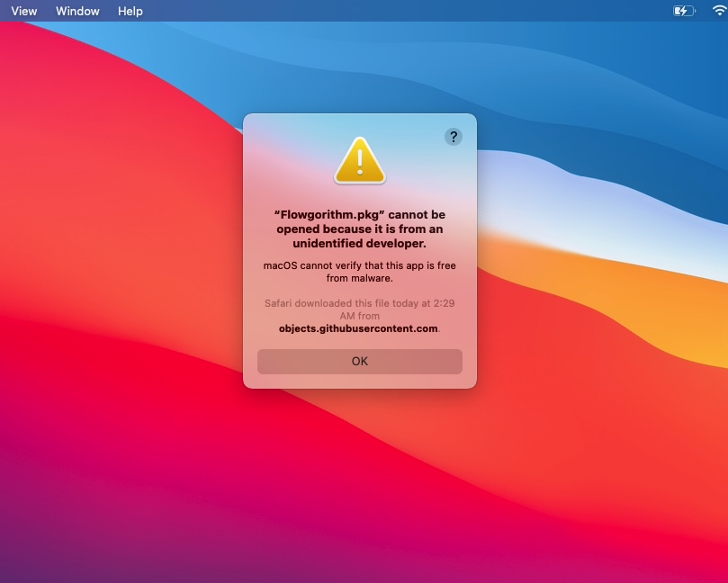

# Flowgorithm for Mac | Flowgorithm v3.3.1

 - Flowgorithm is a free beginner's programming language that is based on simple graphical flowcharts. 
 - Supports C#, C++, Java, JavaScript, Lua, Perl, Python, Ruby, Swift, Visual Basic .NET, and More!
 - Click below to download the latest release!

  

---

### Opening Flowgorithm

After downloading Flowgorithm, double click to open it. macOS may prompt you “Flowgorithm cannot be opened because it is from an unidentified developer”, as shown below. This is completely normal and expected.

If Flowgorithm still can’t be opened, [check your GateKeeper settings](https://support.apple.com/en-us/HT202491) under the General tab in System Preferences > Security & Privacy. Click “Open Anyway” to open Flowgorithm, as shown below.

Flowgorithm will not harm your Mac. This alert only shows up because Flowgorithm is not notarized. Flowgorithm is open source, so you can always examine its source code to make sure it’s safe.

---

### Features 

- Easy to understand output
- Graphical variable watch window
- Interactively generate real code (18+ languages)
- Safe recursion
- Loops, arrays, and flexible expressions
- Multilingual support

# [Home Page](http://www.flowgorithm.org/index.html#Features)
